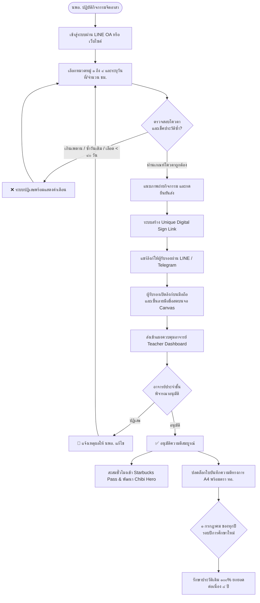

# 📋 ระเบียบปฏิบัติประจำ (Standard Operating Procedure - SOP)
## การบันทึก การรับรอง และการประเมินผลกิจกรรมความดีจิตอาสา นพอ.
### วิทยาลัยพยาบาลทหารอากาศ กรมแพทย์ทหารอากาศ ประจำปีการศึกษา ๒๕๖๙

---

| ข้อมูลการควบคุมเอกสาร (Document Control) | รายละเอียด |
| :--- | :--- |
| **รหัสเอกสาร (Document Code):** | **SOP-RTAFNC-GD-2569** |
| **ฉบับที่ (Version):** | ฉบับที่ ๑.๐ (ประกาศใช้ทางการ) |
| **วันที่มีผลบังคับใช้ (Effective Date):** | **๑ กรกฎาคม ๒๕๖๙** ถึง **๓๐ มิถุนายน ๒๕๗๐** |
| **หน่วยงานผู้รับผิดชอบ (Owner):** | ฝ่ายการสารวัตรและปกครอง นพอ. / กองการศึกษา วพอ.พอ. |
| **ระบบงานเทคโนโลยีสารสนเทศ (IT System):** | ระบบบันทึกความดีจิตอาสา วพอ. ๒๕๖๙ (LINE OA & Web Portal) |
| **ระดับการรักษาความลับ (Classification):** | ปกติ (เผยแพร่แก่ นพอ. ข้าราชการ วพอ. และผู้เกี่ยวข้อง) |

---

## 🎯 ๑. วัตถุประสงค์ (Purpose)

๑.๑ เพื่อกำหนดมาตรฐานการปฏิบัติงาน (Standard Operating Procedure) ในการบันทึก การตรวจสอบ การรับรอง และการประเมินผลกิจกรรมความดีจิตอาสาของนักเรียนพยาบาลทหารอากาศ (นพอ.) ให้เป็นไปอย่างมีแบบแผน โปร่งใส ตรวจสอบย้อนหลังได้ ๑๐๐%  
๑.๒ เพื่อส่งเสริมให้นักเรียนพยาบาลทหารอากาศทุกนายบำเพ็ญกิจกรรมสาธารณประโยชน์และจิตอาสาไม่น้อยกว่า **๕๐ ชั่วโมงต่อปีการศึกษา** (เฉลี่ย ๒๕ ชั่วโมงต่อภาคการศึกษา) ตามเกณฑ์มาตรฐานหลักสูตรพยาบาลศาสตรบัณฑิต และระเบียบกรมแพทย์ทหารอากาศ  
๑.๓ เพื่อวางแนวทางการใช้งานระบบดิจิทัล (Digital Workflow) ทั้งการยืนยันตัวตน, การตรวจสอบโควตาอัตโนมัติ (Automated Quota Validation), การลงลายมือชื่อดิจิทัลสด (Digital Canvas Signature), และการออกใบบันทึกความดีทางการขนาด A4

---

## 👥 ๒. ขอบเขตและกลุ่มเป้าหมาย (Scope & Target Audience)

ระเบียบปฏิบัตินี้มีผลบังคับใช้ครอบคลุม:
- **นักเรียนพยาบาลทหารอากาศ (นพอ.) ทุกชั้นปี:** ชั้นปีที่ ๑ (รุ่น ๖๙), ชั้นปีที่ ๒ (รุ่น ๖๘), ชั้นปีที่ ๓ (รุ่น ๖๗), และชั้นปีที่ ๔ (รุ่น ๖๖)
- **อาจารย์ผู้ควบคุมและอาจารย์ประจำชั้นปี (Supervising Faculty):** วิทยาลัยพยาบาลทหารอากาศ
- **ผู้รับรองกิจกรรม (Activity Approvers):** อาจารย์ วพอ., ผู้ปกครอง, เจ้าหน้าที่หน่วยงานภายนอก/มูลนิธิ/วัด
- **ผู้ดูแลระบบสารสนเทศ (System Administrators):** กองการศึกษา วพอ.พอ.

---

## 📊 ๓. เมทริกซ์บทบาทและความรับผิดชอบ (RACI Matrix)

| กระบวนการทำงาน | นักเรียน (นพอ.) | ผู้รับรองภายนอก/ผู้ปกครอง | อาจารย์ประจำชั้น | ผู้ดูแลระบบ (Admin) |
| :--- | :---: | :---: | :---: | :---: |
| ๑. ปฏิบัติกิจกรรมจิตอาสาและเก็บหลักฐาน | **R** | C | I | I |
| ๒. บันทึกข้อมูลและแนบภาพในระบบดิจิทัล | **R** | I | I | C |
| ๓. ส่งลิงก์ขอรับรองลายมือชื่อดิจิทัล | **R** | **R** | I | I |
| ๔. ลงลายมือชื่อสดบนหน้าจอ (Live Sign) | I | **R** | C | I |
| ๕. ตรวจสอบความถูกต้องและอนุมัติชั่วโมง | I | I | **A / R** | C |
| ๖. พิมพ์ใบบันทึกความดีทางการ A4 | **R** | I | I | I |
| ๗. สรุปผลรายภาค/ปี และเลื่อนชั้นปี ๑ ก.ค. | I | I | **A** | **R** |

> **คำอธิบาย RACI:**  
> • **R (Responsible):** ผู้มีหน้าที่ปฏิบัติงานโดยตรง  
> • **A (Accountable):** ผู้มีอำนาจตัดสินใจและรับผิดชอบผลสัมฤทธิ์  
> • **C (Consulted):** ผู้ให้คำปรึกษา แนะนำ หรือร่วมรับรอง  
> • **I (Informed):** ผู้ได้รับการแจ้งข้อมูลเพื่อทราบผล  

---

## 🔄 ๔. แผนผังกระบวนการทำงานภาพรวม (End-to-End Workflow Diagram)

---

## 📜 ๕. ขั้นตอนการปฏิบัติงานมาตรฐาน (Standard Operating Procedures)

### 【SOP-GD-01】การยืนยันตัวตนและการเข้าสู่ระบบ (Authentication & Profile Setup)
1. **การเข้าถึงระบบ (Access Channels):**
   - **ทางเลือกที่ ๑ (แนะนำ):** เปิดผ่าน Rich Menu บน LINE Official Account วพอ. (เข้าใช้งานผ่านระบบ LINE LIFF ไม่ต้องพิมพ์รหัสผ่านซ้ำ)
   - **ทางเลือกที่ ๒:** เข้าผ่านเว็บบราวเซอร์ `student-dashboard.html` บนอุปกรณ์คอมพิวเตอร์หรือแท็บเล็ต
2. **การระบุตัวตน (Credential Validation):**
   - กรอก **รหัสนักเรียน ๗ หลัก** (เช่น `6910101`)
   - รหัสผ่านเริ่มต้นคือ รหัสนักเรียน
3. **การควบคุมความปลอดภัย (Security Protocol):**
   - เมื่อเข้าใช้งานครั้งแรก ให้เข้าไปที่เมนู **"โปรไฟล์ (Profile)"** เพื่อตรวจสอบชื่อ-สกุล, ชั้นปี, กองร้อย และตั้งรหัสผ่านส่วนตัวใหม่
   - ข้อมูลรูปภาพและสถานะของ นพอ. จะถูกคุ้มครองตามหลักการคุ้มครองข้อมูลส่วนบุคคล (PDPA)

---

### 【SOP-GD-02】การตรวจสอบเกณฑ์และบันทึกกิจกรรมความดี ๙ หมวดหมู่ (Deed Submission & Quotas)
นพอ. ต้องตรวจสอบกิจกรรมที่ตนเองปฏิบัติให้สอดคล้องกับระเบียบ ๙ หมวดหมู่ ดังนี้:

#### ตารางเกณฑ์ข้อจำกัดเพดานเวลา (Academic Year 2569 Quotas & Limits)
| หมวด | ชื่อหมวดหมู่ | เพดานต่อครั้ง / ต่อวัน | โควตาสะสมสูงสุด | การควบคุมอัตโนมัติของระบบ |
| :---: | :--- | :---: | :---: | :--- |
| **๑** | **บริจาคโลหิต / เกล็ดเลือด / พลาสมา** | **๘ ชม. / ครั้ง** | ไม่เกิน **๔ ครั้ง / ปี** (๓๒ ชม.) | • ตรวจสอบระยะห่าง **อย่างน้อย ๙๐ วัน (๓ เดือน)** จากครั้งก่อนหน้า • ต้องแนบภาพสมุดบริจาคโลหิตหรือใบเสร็จสภากาชาดไทย |
| **๒** | **โครงการภายนอก (คำสั่ง วพอ.)** | สูงสุด **๘ ชม. / วัน** | ตามคำสั่ง วพอ. | • แนบภาพถ่ายและระบุเลขที่คำสั่ง วพอ./ทอ. |
| **๓** | **ช่วยเหลืองานภายใน วพอ.** | สูงสุด **๘ ชม. / วัน** | ตามงานที่มอบหมาย | • กิจกรรม ๕ส, เวรจิตอาสาห้องยา, งานสนับสนุนอาจารย์ |
| **๔** | **เข้าอบรมที่ วพอ. จัดให้** | สูงสุด **๔ ชม. / วัน** | ตามเวลาอบรมจริง | • สัมมนา อบรมจริยธรรม (ไม่นับวิชาเรียนตามหลักสูตร) |
| **๕** | **ช่วยงานหน่วยงาน / ชุมชน / มูลนิธิ** | สูงสุด **๔ ชม. / วัน** | ตามเวลาจริง | • กิจกรรมจิตอาสาที่เข้าร่วมกับชุมชน/มูลนิธิภายนอก |
| **๖** | **ทำนุบำรุงศาสนสถาน** | **สูงสุด ๑ ชม. / ครั้ง** | **ไม่เกิน ๔ ชม. / ปี** | • ระบบล็อกช่องชั่วโมง **ห้ามเกิน ๑ ชม.** • ยอดสะสมทั้งปีการศึกษาต้องไม่เกิน ๔ ชม. |
| **๗** | **งานฟรีทั่วไป / ช่วยผู้ปกครอง** | **สูงสุด ๑ ชม. / ครั้ง** | **๒ ชม./เทอม (๔ ชม./ปี)** | • ระบบล็อกช่องชั่วโมง **ห้ามเกิน ๑ ชม.** • เช็คยอดสะสมเทอม ๑ และเทอม ๒ ไม่เกิน ๒ ชม./เทอม |
| **๘** | **กิจกรรมจงรักภักดีต่อสถาบัน** | สูงสุด **๔ ชม. / ครั้ง** | ไม่เกิน **๘ ชม. / ปี** | • จิตอาสาพระราชทาน ๙๐๔, พิธีถวายพระพรวันสำคัญ |
| **๙** | **ชม. บทบาทหน้าที่พิเศษ** | - | **๒๐ ชม./เทอม (๔๐ ชม./ปี)** | • น.ปกครอง, แอดมิน, น.สารสนเทศ, น.ตัดต่อ, น.พยาบาล • หากมีหลายตำแหน่ง ให้รับสิทธิ์ได้เพียง ๑ ตำแหน่ง |

#### ระบบป้องกันความผิดพลาดอัตโนมัติ (Automated Safeguards):
1. **การป้องกันรายการซ้ำ (Duplicate Prevention):** หากมีประวัติบันทึกในหมวดหมู่เดียวกันและวันที่ทำกิจกรรมตรงกันแล้ว ระบบจะปฏิเสธการบันทึกทันที
2. **การคำนวณโควตา Real-time:** ทุกครั้งที่เลือกหมวดหมู่ ระบบจะคำนวณชั่วโมงที่ใช้ไป ชั่วโมงคงเหลือ และแสดงแถบสถานะให้ นพอ. ทราบก่อนกรอกข้อมูล

---

### 【SOP-GD-03】การส่งขอรับรองและการลงนามดิจิทัลสด (Digital Signature Workflow)
๑. เมื่อ นพอ. บันทึกข้อมูลและแนบภาพถ่ายเสร็จสิ้น ระบบจะสร้าง **ลิงก์รับรองความดีเฉพาะรายการ (Unique Tokenized Approval Link)**  
๒. หน้าจอแสดงป๊อปอัปให้ นพอ. เลือก:
   - **ปุ่ม "แชร์ผ่าน LINE เพื่อเซ็นชื่อ":** ส่งเข้าแชต LINE ของอาจารย์ ผู้ปกครอง หรือหน่วยงานภายนอก
   - **ปุ่ม "คัดลอกลิงก์":** ส่งผ่านช่องทางอื่น เช่น Telegram หรือ E-mail  
๓. ขั้นตอนสำหรับผู้รับรองความดี (Approver Protocol):
   - ผู้รับรองเปิดลิงก์บนสมาร์ตโฟน (ระบบออกแบบ Responsive รองรับทุกขนาดหน้าจอ)
   - หน้าจอแสดงภาพถ่ายกิจกรรม, ชื่อ-สกุล นพอ., รายละเอียดกิจกรรม, วันที่ และจำนวนชั่วโมง
   - ผู้รับรองเลือกสถานะตนเอง:
     * ๑. อาจารย์ วิทยาลัยพยาบาลทหารอากาศ
     * ๒. ผู้ปกครอง / บิดา-มารดา
     * ๓. หน่วยงานภายนอก / ประธานมูลนิธิ / เจ้าอาวาสวัด
     * ๔. บุคคลอื่น ๆ
   - พิมพ์ชื่อ-สกุล และตำแหน่ง
   - **ใช้ปลายนิ้วหรือปากกาสไตลัสลงลายมือชื่อสดบนกรอบผืนผ้าใบดิจิทัล (Digital Signature Canvas)**
   - กดปุ่ม **"ยืนยันการรับรอง"**
๔. ข้อมูลลายเซ็นจะถูกแปลงเป็นเวกเตอร์โปร่งใส บันทึกพร้อมประทับเวลา (Timestamp) เข้าสู่ฐานข้อมูลทันที

---

### 【SOP-GD-04】การตรวจสอบและอนุมัติของอาจารย์ผู้ควบคุม (Teacher Dashboard Operations)
๑. อาจารย์ผู้ควบคุมเปิดหน้าเว็บ `teacher-dashboard.html` เข้าสู่ระบบด้วยรหัสผ่านประจำชั้น  
๒. การตรวจสอบรายการรออนุมัติ (Pending Deeds):
   - ตรวจสอบรูปภาพกิจกรรม ความสมบูรณ์ของเนื้อหา และความถูกต้องของหมวดหมู่
   - ตรวจสอบลายมือชื่อดิจิทัลและตัวตนของผู้รับรอง
๓. การสั่งการอนุมัติ:
   - **อนุมัติรายบุคคล (Single Approve):** ตรวจรับรองรายการเฉพาะบุคคล
   - **อนุมัติทั้งกลุ่ม (Batch Approve):** ใช้สำหรับกิจกรรมจิตอาสารวมที่มีคำสั่ง วพอ.
   - **ปฏิเสธรายการ (Reject):** ใส่เหตุผลที่ปฏิเสธ (เช่น ภาพไม่ชัดเจน หรือกิจกรรมไม่ตรงหมวดหมู่) เพื่อให้ นพอ. รับทราบและส่งใหม่
๔. การสรุปรายงานผลราชการ (Reporting):
   - ระบบมีฟังก์ชัน **Export Word (.docx)** สร้างบันทึกข้อความราชการตามแบบฟอร์ม ทอ. พร้อมตารางสรุปสถิติประจำเดือนให้อัตโนมัติ

---

### 【SOP-GD-05】การประเมินผลรอบปี ใบบันทึกความดี A4 และการยกยอดสะสม (Annual Rollover & Dual Counter)
๑. **การออกใบบันทึกความดีทางการขนาด A4 (Official Deed Slip):**
   - เมื่อรายการได้รับอนุมัติ นพอ. สามารถเปิดหน้า `deed_slip.html` เพื่อดูเอกสารแบบฟอร์มทางการ
   - เอกสารประกอบด้วย: ตราสัญลักษณ์ ทอ. ลายน้ำ รหัสนักเรียน วันที่ รายละเอียด ภาพถ่ายหลักฐาน และบล็อกลายเซ็นดิจิทัลของผู้รับรอง
   - สามารถกดสั่งพิมพ์ (Print) หรือบันทึกเป็นไฟล์ PDF เพื่อใช้แนบแฟ้มสะสมงาน (Portfolio) ได้ทันที
๒. **รอบปีการศึกษาและการคำนวณชั่วโมง (Academic Year Cycle):**
   - ภาคการศึกษาที่ ๑: ๑ กรกฎาคม – ๓๐ พฤศจิกายน
   - ภาคการศึกษาที่ ๒: ๑ ธันวาคม – ๓๐ มิถุนายน
   - เกณฑ์ผ่านการประเมินประจำปี: **อย่างน้อย ๕๐ ชั่วโมงต่อปีการศึกษา**
๓. **สถาปัตยกรรมยกยอดสะสมต่อเนื่อง (Dual-Counter Continuity):**
   - **ไม่ลบข้อมูลเดิม (Zero Data Loss):** ประวัติความดีปีก่อนหน้าของ นพอ. ทุกคน (๓,๐๔๐ รายการเดิม) จะถูกเก็บรักษาไว้อย่างครบถ้วน ๑๐๐%
   - **ระบบ ๒ มาตรวัด:**
     * *มาตรวัดประจำปี (Annual Counter):* รีเซ็ตนับ ๐ ในวันที่ ๑ ก.ค. เพื่อประเมินเกณฑ์ ๕๐ ชม. ของปีปัจจุบัน
     * *มาตรวัดสะสมตลอดหลักสูตร (All-Time Cumulative Counter):* รวมชั่วโมงตลอด ๔ ปีการศึกษา สะสมต่อเนื่องเพื่อยื่นขอสำเร็จการศึกษา
๔. **กระบวนการเลื่อนชั้นปีประจำวันที่ ๑ กรกฎาคม (July Rollover Protocol):**
   - นพอ.รุ่น ๖๖ (ปี ๔) ➔ ปรับเป็นสถานะ **สำเร็จการศึกษา / ศิษย์เก่า (Alumni)**
   - นพอ.รุ่น ๖๗ (ปี ๓) ➔ เลื่อนเป็น **ชั้นปีที่ ๔**
   - นพอ.รุ่น ๖๘ (ปี ๒) ➔ เลื่อนเป็น **ชั้นปีที่ ๓**
   - นพอ.รุ่น ๖๙ (ปี ๑) ➔ เลื่อนเป็น **ชั้นปีที่ ๒**
   - นพอ.รุ่น ๗๐ (เข้าใหม่) ➔ บรรจุเข้าสู่ระบบเป็น **ชั้นปีที่ ๑**

---

## ⚠️ ๖. การจัดการกรณีเกิดข้อขัดข้องและข้อยกเว้น (Exception Handling)

| รหัสเหตุการณ์ | เหตุการณ์ผิดปกติ | ขั้นตอนการแก้ไขตาม SOP |
| :---: | :--- | :--- |
| **EX-01** | ระบบแจ้งเตือนโควตาเต็ม | นพอ. ตรวจสอบชั่วโมงคงเหลือ และเลือกบันทึกในหมวดอื่นที่ยังมีโควตา |
| **EX-02** | ระบบแจ้งเตือนรายการซ้ำ | ตรวจสอบประวัติความดี หากเป็นกิจกรรมวันเดียวกัน ให้รวมเวลาเป็นรายการเดียว |
| **EX-03** | บริจาคโลหิตยังไม่ครบ ๙๐ วัน | ต้องเว้นระยะห่างตามมาตรฐานแพทย์กาชาด ๙๐ วัน ระบบจึงจะอนุญาตให้ส่งครั้งถัดไป |
| **EX-04** | อาจารย์ส่งคืน/ปฏิเสธรายการ | ตรวจสอบเหตุผลในระบบ ปรับปรุงหลักฐานให้ถูกต้อง และกดส่งบันทึกใหม่ |
| **EX-05** | ลืมรหัสผ่านเข้าใช้งาน | ประสานอาจารย์ผู้ควบคุมประจำรุ่น หรือแอดมิน เพื่อรีเซ็ตรหัสผ่านกลับเป็นรหัสนักเรียน ๗ หลัก |
| **EX-06** | ผู้รับรองเปิดลิงก์เซ็นชื่อไม่ได้ | ตรวจสอบว่าเปิดผ่านเบราว์เซอร์ปกติ หรือให้นักเรียนคัดลอกลิงก์ส่งใหม่อีกครั้ง |

---

## 📑 ๗. ภาคผนวกและเอกสารอ้างอิง (Appendices)

- **ภาคผนวก ก:** ตารางสรุปฐานข้อมูลปีการศึกษา ๒๕๖๙ (`Main_2569_Summary.csv`)
- **ภาคผนวก ข:** คู่มือบนระบบเว็บแอปพลิเคชัน (`frontend/manual.html`)
- **ภาคผนวก ค:** เครื่องมือตรวจสอบความสมบูรณ์ของระบบ (`data/validate_database.py`)
- **ภาคผนวก ง:** เอกสารใบบันทึกความดีอิเล็กทรอนิกส์ A4 (`frontend/deed_slip.html`)

---

*จัดทำโดย คณะกรรมการพัฒนาระบบเทคโนโลยีสารสนเทศ วิทยาลัยพยาบาลทหารอากาศ กรมแพทย์ทหารอากาศ*
